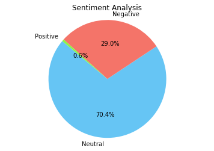
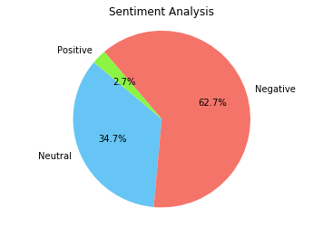
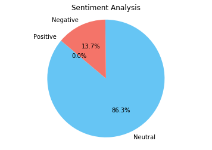

# Data Mining with Whatsapp Chats

## The various models used

- utilities.py : clean text
- basics.py: to extract properties of text
- sentiment_analysis: to construct the pie chart

## Samples

